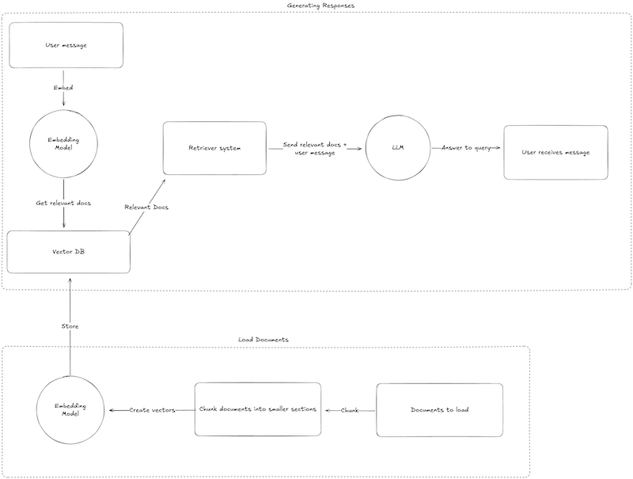

# RAG Chatbot

## Overview
This project builds a **Retrieval-Augmented Generation (RAG) chatbot** designed to help users extract and understand key insights from **Amazon’s annual report**. By integrating a document retrieval system with a conversational AI, the chatbot enables users to ask questions about the report and receive accurate, context-aware answers. Unlike traditional search methods, this approach dynamically retrieves relevant information from the report before generating responses, ensuring that answers are grounded in the source material. The chatbot also maintains **conversation memory**, allowing for follow-up questions that build on previous interactions, making financial and business analysis more accessible and intuitive.

## Features
- **PDF Processing**: Extracts text from PDFs using `PyMuPDF (fitz)`.
- **Text Chunking**: Splits text into manageable chunks for efficient embedding.
- **Vector Database**: Uses **FAISS** for fast retrieval of relevant document sections.
- **Conversational Memory**: Remembers chat history for a seamless user experience.
- **LLM Integration**: Utilizes `meta-llama/llama-3.1-70b-instruct:free` via LangChain’s `ChatOpenAI`.
- **Interactive UI**: Built with **Streamlit** for easy deployment and user interaction.

## Packages Used:

1. 🦜🔗: **Langchain** is used to handle the process to send messages to the model, and also has in-built memory function.
2. 🤖: **Streamlit** is used for the frontend interface of the chatbot - so we don’t have to worry about designing anything!
3. [Sentence Transformers](https://sbert.net/): is the go-to FREE way to generate vectors from your text.

## Installation

### 1. Clone the Repository
```sh
git clone https://github.com/yourusername/rag-chatbot.git
cd rag-chatbot
```

### 2. Set Up a Virtual Environment
```sh
python -m venv venv
source venv/bin/activate  # On Windows, use 'venv\\Scripts\\activate'
```

### 3. Install Dependencies
```sh
pip install -r requirements.txt
```

### 4. Set Up Environment Variables
Create a `.env` file in the project directory and add the following:
```ini
API_KEY=your_openai_api_key
BASE_URL=https://api.openai.com/v1
```

### 5. Download the PDF
Run the following command to download the annual report:
```sh
wget -O annual_report.pdf "https://s2.q4cdn.com/299287126/files/doc_financials/2024/ar/Amazon-com-Inc-2023-Annual-Report.pdf"
```

### 6. Run the Chatbot
```sh
streamlit run ./main.py
```

### 7. Expose Locally via LocalTunnel (Optional)
If you want to make your Streamlit app accessible online, install LocalTunnel:
```sh
npm install -g localtunnel
lt --port 8501
```
This will generate a public URL to access the chatbot.

## How It Works:

The RAG chatbot follows this architecture:



1. **Document Processing:**
   - The PDF is read using `PyMuPDF`, and the text is extracted.
   - Text is split into smaller chunks for better retrieval.

2. **Embedding & Storage:**
   - Each text chunk is embedded using `sentence-transformers/all-MiniLM-L6-v2`.
   - Embeddings are stored in **FAISS**, a high-speed vector database.

3. **Retrieval & Augmented Generation:**
   - When a user asks a question, the chatbot retrieves the most relevant text chunks from FAISS.
   - The retrieved context is fed into `meta-llama/llama-3.1-70b-instruct:free`, which generates an answer.

4. **Conversational Memory:**
   - The chatbot retains previous interactions, allowing for seamless follow-ups.
   
## Project Structure
```
├── main.py                # Main application logic
├── requirements.txt       # Required Python dependencies
├── README.md              # Documentation
├── .env                   # Environment variables (ignored in Git)
├── annual_report.pdf      # Sample PDF document
├── assets/                # Directory for images (e.g., architecture diagram)
└── venv/                  # Virtual environment (ignored in Git)
```

## Future Improvements
- **Add support for multiple PDFs**.
- **Integrate additional LLMs (e.g., Mistral, Claude)**.
- **Improve response speed with optimized embeddings**.

## License
This project is licensed under the MIT License. Feel free to use and modify it.

## Author
[Samarth Munde](https://github.com/mundesamarth)

---
_If you found this project useful, feel free to ⭐ star the repository!_

